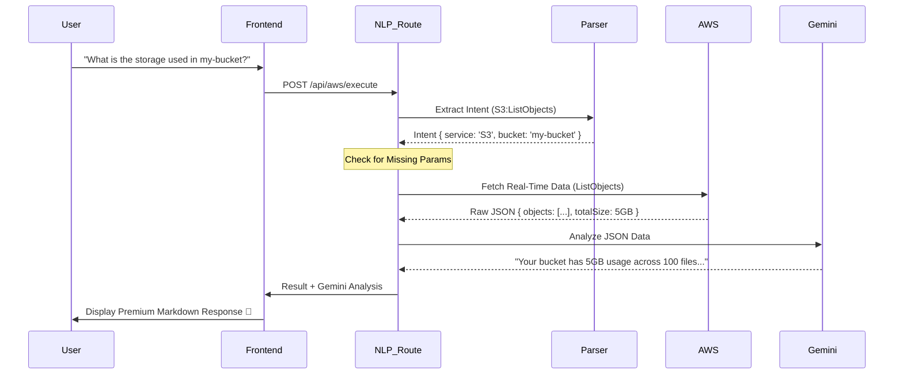

# 🏗️ AWS Copilot Project Architecture

Vanakam da! Here is the complete breakdown of our project architecture and how the different files work together to create the Gemini-powered AWS experience.

## 📂 Project Structure & File Roles

### 1. Root Layer
- [server.js](./server.js): The entry point. Configures the Express server, loads environment variables (`.env`), and mounts all routers.
- `.env`: Stores sensitive API keys (Gemini, AWS) and configuration. (Ignored by Git)

### 2. Services Layer (The Brains 🧠)
This is where the core logic lives:
- [services/intentParser.js](./services/intentParser.js): Uses advanced regex to map your plain English text to specific AWS actions (e.g., "List objects" → `S3:ListObjects`).
- [services/geminiService.js](./services/geminiService.js): Integrates with Google Gemini AI. It analyzes raw AWS data and turns it into a human-friendly response.
- [services/conversationEngine.js](./services/conversationEngine.js): Manages the "Two-Way" flow. If you forget a bucket name, this engine detects it and asks you for it.
- [services/ssoService.js](./services/ssoService.js): Handles the complex AWS SSO (IAM Identity Center) login flow and session management.
- [services/awsClient.js](./services/awsClient.js): A shared factory that creates AWS SDK clients (S3, EC2, etc.) using your credentials and selected region.

### 3. Routes Layer (The API 🛣️)
- [routes/nlp.js](./routes/nlp.js): The main orchestration route. It receives your chat message and coordinates between the Parser, Execution, and Gemini Analysis.
- **Service Routes:** (`routes/s3.js`, `routes/lambda.js`, etc.) Specific API endpoints for manual resource management.
- [routes/auth.js](./routes/auth.js): Handles login, logout, and credential verification.

### 4. Frontend Layer (The UI 💻)
- [frontend/src/hooks/useChat.js](./frontend/src/hooks/useChat.js): The main "State Machine" for the chat UI. It handles message history, loading states, and stores the conversational context.
- [frontend/src/App.jsx](./frontend/src/App.jsx): Main layout and dashboard assembly.

---

## 🔄 The Two-Way AI Workflow

---

## ✅ Best Practices in Our Design
1. **Separation of Concerns:** NLP logic is separate from AWS API logic.
2. **Context Persistence:** The frontend remembers what you were doing so you can answer clarifying questions.
3. **AI Fallback:** If Gemini is unavailable, the system still shows the raw AWS success/error data so you aren't stuck.
